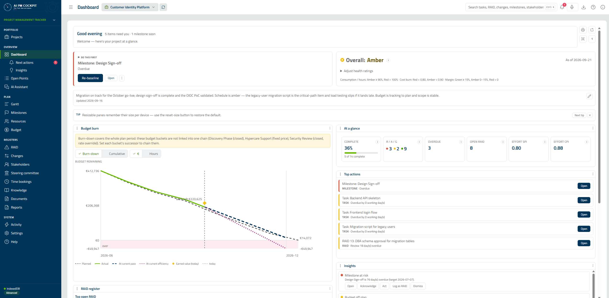

# AI PM Cockpit

[](https://gitlab.example.com/example-group/public-collab/aipm-cockpit/-/commits/main)
[](https://gitlab.example.com/example-group/public-collab/aipm-cockpit/-/commits/main)
[](./CHANGELOG.md)
[](./LICENSE)

> **The AI project-management cockpit that knows *your* project.**
>
> A command surface for project leads with a Claude copilot grounded in your operating guides and the view you're in — it surfaces the next best action and can act on it. It plugs into the Microsoft 365 / Jira / Timelog stack you already use, so it accelerates your workflow instead of becoming one more place to re-key data. Local-first, bring-your-own-key, open source — no backend account required.



<sub>The landing dashboard, loaded from the bundled demo project.</sub>

---

## Why AI PM Cockpit

**A copilot that knows *this* project — not a chatbot bolted on.**
The Claude assistant is grounded in your operating guides, so its advice fits this project rather than reading like a generic chatbot. Per-view **"Ask Claude"** prompts and one-tap starters (a risk review, a weekly status update, a stakeholder update, "prioritize all tasks") mean the tool tells you the next step — and can take it, creating and updating tasks, RAID, changes, milestones, and stakeholders in natural language. The **Action Center** ranks live project data into next-best-actions and **learns** from how you respond (act / snooze / dismiss).

**It tells you what it cannot see.**
The assistant knows which view you are on and — on Open Points, Workload, Gantt and Budget — what your current filters are actually showing. Where no tool can answer it says so, by name: time bookings, the activity log, cross-project portfolio data, RACI assignments, calendar absences. A copilot that reports its own blind spots is one whose answers you can check.

**Plugs into your stack, not another silo.**
Pull people in from Outlook, attach documents straight from SharePoint, push milestones to your calendar, sync a two-way Jira project (plus optional read-only monitor projects), and fold actual Timelog bookings into your budget — so you accelerate your existing workflow instead of re-keying the same data into yet another tool.

**Own your data.**
It runs in your browser with no backend account. Bring your own API keys — they're encrypted at rest (AES-256-GCM, device-sealed). Your workspace lives in a local file, in-browser IndexedDB, or *your own* Turso database — never a vendor's. EUPL-1.2 open source.

**One cockpit for the whole engagement.**
Project-health RAG, RAID and change-control registers, a stakeholder register with RACI, resource capacity and budget with Earned Value, and a multi-project portfolio — in one surface, with a landing dashboard that opens on what needs you.

**A solo consultant and a regulated multi-workstream programme run the same tool.**
No two project leads track the same things, so the cockpit bends to fit: see work as a table, Kanban board or Gantt, toggle whole feature modules off, pick a Simple / Modular / Advanced **mode** that gates complexity, and start from a reusable **project template** that presets it all.

### Built to be trusted

Not a prototype, and not shelfware: the cockpit is **already in active friendly-user testing**, exercised against real projects by real project leads rather than sitting behind a demo. It is backed by 9,100+ automated tests with enforced coverage floors, a WCAG accessibility gate (axe across 16 views × 5 theme/scheme combinations), semgrep SAST, and duplication and file-size ratchets — all blocking in CI. Local-first and bring-your-own-key by design: no server stores your data or credentials (the handful of API routes are stateless proxies to services you configure), so the browser profile is the security boundary (see [Security Model](#security-model)).

### See it in a minute

1. `npm install && npm run dev`, open [http://localhost:3000](http://localhost:3000), and click **Explore a demo project** to load a realistic workspace.
2. Add or import tasks; view them as a table, a Kanban board, or a Gantt chart.
3. Open the Dashboard for health, ranked top actions, and trends — then ask the copilot "What's next?".
4. Wire up Jira / Microsoft 365 / Timelog in Settings when you want it plugged into your stack.

---

## Full capability reference

The rest of this document is the in-depth reference: the complete feature list, storage backends, integrations, automation, the sample workspace, and the security model.

## Features

Each row keeps a one-line summary. Expand **Details** for the full description.

| Feature | Description |
|---------|-------------|
| Multi-project portfolio | Manage many projects from one app — each project is a full, independent workspace with a metadata header.<br><details><summary>Details</summary>Every project carries its own header (client, NACE sector, deployment model, identity types, regulatory requirements, internal/external key stakeholders). Switch projects from the top-bar switcher; create, edit, archive/restore, and permanently delete them. Hard-delete requires typing the project name into a confirm dialog. **File mode** keeps a local registry of per-project files; **Turso mode** stores every project in one shared multi-tenant database (the database is the source of truth for the project list). The global File ↔ Turso switch lives in Settings → Integrations. Export operates on the current project.</details> |
| Task management | Create, edit, delete, bulk-edit, and filter by priority / assignee / group / label, with a workflow status and a Table/Board (Kanban) toggle.<br><details><summary>Details</summary>Effort fields (Original estimate & Time spent in w/d/h/m, Jira basis 1w=5d 1d=8h) with hideable/sortable Est./Spent columns and an inline effort progress bar. Per-field inline validation reveals errors on blur/submit and disables Save until the form is valid. A six-state **workflow status** (To Do / In Progress / On Hold / In Review / Cancelled / Done) is the source of truth for completion (`completedDate` is auto-managed); Cancelled tasks are terminal but excluded from overdue flags and metrics, and a "Hide finished" toggle hides Done + Cancelled. Switch the Open Points view between a sortable table and a **Kanban board** — drag a card between status columns or use the per-card status select; Jira-synced tasks derive their status from the Jira status category and are read-only until the next sync. The inline status dropdown carries a hover affordance so it reads as editable.</details> |
| Gantt chart | Visual timeline with drag-and-drop reorder and dependency arrows.<br><details><summary>Details</summary>Clicking a task name opens the task editor. Milestone overlays appear when the Milestones module is enabled; an inline add-milestone control creates milestones directly on the chart, and hovering a milestone shows a formatted date label (like task bars).</details> |
| Task dependencies | FS / SS / FF / SF predecessor relationships with cycle detection.<br><details><summary>Details</summary>Dependencies are validated on save — circular chains are rejected before they can be persisted.</details> |
| Groups & labels | Categorize tasks freely; filter by group or label. |
| AI assistant (Claude) | Context-aware Claude assistant — knows your current view/mode, is grounded in operating guides, and offers per-view "Ask Claude" prompts; ask questions or create/update tasks in natural language (user-supplied API key, Settings → AI).<br><details><summary>Details</summary>All AI features (chat, Action Center "Analyze with AI", scheduled jobs, weight suggestions, and describe-to-create) are off by default behind an **Enable AI assistant** master switch (Settings → AI); the AI configuration stays collapsed until you enable it. Per-view "Ask Claude" suggestions, a header menu of general prompts ("Explain this", "What's next?"), and one-tap chat starters that send a complete brief on click — risk review, weekly status, stakeholder update, prioritize all tasks, and process an attachment; the assistant is grounded in your operating guides and the current view/mode. Includes a live token-usage panel, a Stop button to interrupt a running response, and a pop-out window. The model dropdown is populated live from your account (Anthropic `/v1/models`, newest first) with a curated offline fallback, so new model releases appear without an app update; the API key is format-validated before it is saved (an invalid key is discarded with a notice). The pop-out is a read-only mirror — its tools cannot mutate data. Claude can create, update, delete, and summarize across the whole register — tasks, RAID items, change-control items, milestones, and stakeholders — via tool calls, each routed through its sanitizer. **Document ingestion:** attach a PDF, image, or text file and Claude reads it natively (no parsing dependency) to extract and create records on request. **Inline edit:** an "Ask Claude" popover on each task (✨ hover icon, row menu, or Kanban card) lets you describe an edit in natural language and confirm a preview diff before it's applied — no chat window needed. **Deduplicate & unify tasks:** from Open Points, Claude proposes which tasks look like duplicates and how to merge each group into one; you review and confirm before anything is combined, and a merge is a single undo step. **Usage-limit notices:** when Claude's own weekly/rate limit is hit (HTTP 429) or your configured token cap is reached, a clear advisory notice appears — it never blocks the app, and in chat it is appended without clearing history. **Configurable AI limits:** set the maximum assistant turns per message (default 12) and a token-counting multiplier (default 5); the session/weekly caps are your own advisory limits.</details> |
| AI project assistance | Describe-to-create projects, create-from-source import, Action Center "Analyze with AI", scheduled portfolio-analysis jobs, and AI-suggested next-action weights.<br><details><summary>Details</summary>**Use AI** (create wizard): write a plain-language brief and Claude proposes the project setup (name, dates, products, feature modules) plus optional starter content, pre-filling the 3-step wizard for review — nothing is written until you create. **Create from a source:** upload one or more files (PDF/image/text — up to 10 at once, invalid files skipped with a notice), pick a SharePoint document, or paste a Confluence page URL (fetched via a same-origin proxy reusing your Atlassian credentials) and Claude pre-fills the details; a progress modal with a Cancel button lets you abort the in-flight import. **Analyze with AI** (Action Center): one Claude call returns a triage summary of the action queue plus net-new advisory actions — advisory only, the deterministic engine is unchanged. **Scheduled jobs:** opt-in recurring portfolio-analysis jobs (daily/weekly) that run while the app is open (on load, re-focus, and a light interval) and catch up on next open; results surface as a desktop notification and a per-job run history (no server cron; advisory only; each run is a billed call, so off by default). **Suggest with AI** (next-actions settings): proposes confidence-weight (and optionally threshold) adjustments from your project, snapshot trends, and act/snooze/dismiss history — review each row's rationale and Accept; values are always clamped to safe bounds.</details> |
| Steering committee | Record the committee name, its members (linked to resources), the meeting schedule, and information-pack rules.<br><details><summary>Details</summary>Each meeting carries a date, title, agenda, and location; "information schedule" rules set how many working days before each meeting a pack should circulate. The resulting pack reminders appear in the Action Center, and the committee's meetings plus reminder due-dates can be pushed to your Outlook calendar (re-pushing never duplicates).</details> |
| Timezones | Per-project operating timezone and a per-device default, with timezone-aware day-boundary logic and timestamp display in a chosen zone.<br><details><summary>Details</summary>Set a per-project timezone and a per-device default (plus a list of additional zones); what counts as overdue, due today, or due soon follows the resolved timezone instead of UTC. A top-bar switcher renders timestamps in the activity log, version history, and trends in a display timezone (Default / UTC / your additional zones); the choice applies for the session and resets on reload. The Calendar view shows a live multi-timezone "world clock" strip when extra zones are configured.</details> |
| Guided tour & demo | A first-run walkthrough of the main areas, a one-click "Explore a demo project", and six themed tours you can replay from Help → Guided tours.<br><details><summary>Details</summary>Per-device; the tour runs in the modern layout only (not classic or pop-outs). "Explore a demo project" loads the sample workspace so you can try the app with realistic data. Replay is the **Guided tours** tab of the in-pane Help view — there is no "Take the tour" entry in the floating Help menu, which this row claimed until 0.216.0.</details> |
| Help | Grouped, searchable Help covering every view in the app, at the reading depth you choose.<br><details><summary>Details</summary>Concepts, workflows, features and "what's automated", rendered identically by the floating Help window and the in-pane Help view. Three reading levels — Guided adds a plain-language primer to each concept, Standard is the default, Expert puts the reference sections first — set from the Help window itself or Settings → Appearance. A gate keeps every nav view covered by some entry, and a second one keeps the German translated rather than copied. Also documents the features that are not views: saved views, installing the app, undo, inline AI edits, the weekly digest, column widths and printing.</details> |
| Installable PWA | Install the tracker as a standalone desktop/mobile app via a web manifest + minimal service worker.<br><details><summary>Details</summary>The service worker does no caching — every request goes to the network, so installed copies never serve stale bundles. Periodic Background Sync (running scheduled jobs while closed) is intentionally not included; the baseline runs due jobs when you next open the app.</details> |
| Voice commands | Speak commands in English or German (Web Speech API). |
| Reports | Summary view with overdue, due-soon, and completion stats.<br><details><summary>Details</summary>Addable report cards (Stakeholder, RAID, Resource, Budget, and more) built on a shared sortable/filterable/resizable report table; each card prints on its own.</details> |
| RAID register | Risks / Assumptions / Issues / Dependencies log with parent/child cycle detection and true deep-linking (`#raid/<id>`).<br><details><summary>Details</summary>Sortable/filterable table, severity and status tracking, optional links to stakeholders, and RAID-review reminders for stale or overdue items.</details> |
| Change Log | RAID-sibling change-control register with a 6-state approval workflow.<br><details><summary>Details</summary>Proposed → Implemented / Deferred, with impact rating, schedule-day and cost figures, an optional Change → RAID link, optional stakeholder links, and a printable Change Report that feeds the Scope RAG on the dashboard.</details> |
| Stakeholder register | Sortable/filterable register with a RACI matrix (per stakeholder × milestone), Influence/Interest grid, and engagement-level tracking.<br><details><summary>Details</summary>A quadrant-based engagement policy drives stakeholder-communication reminders from due-soon milestones, open RAID items, and pending changes the stakeholder is linked to (see Automation / Notifications). The RACI matrix has an additive type-to-filter for its people columns (add / remove / clear; duplicate names are disambiguated).</details> |
| Resource planner & address book | Address book (name, title, contact, birthday), two-dimensional roles (discipline × grade) with internal/external rates, absences, and a per-period utilization planning grid.<br><details><summary>Details</summary>Rolls up into capacity, cost, and margin. Sub-views: Directory, Workload, Calendar, Planning, and Manage Roles. The **Workload** view is actionable — edit a resource's near-term utilization inline and reassign or reschedule overdue tasks directly from it. Birthdays drive optional reminders; absences feed working-day calculations across the app. Rate cards are entered as **day rates** (internal/d, external/d) — the day rate is the source of truth and the hourly rate is auto-derived from workday hours, with only one unit editable at a time. The Planning grid adds a **Capacity (h)** column, and both Planning and Workload carry a **hide external resources** toggle (a display filter only — externals stay available as reassignment targets).</details> |
| Budget planner | PO-line budget buckets (T&M / fixed-price) with per-role allocations, CCI, and win/loss with spillover.<br><details><summary>Details</summary>Detailed (per-role) or blended (per-discipline, average grade rate) planning per bucket; multi-currency via ECB FX rates with per-rate EUR overrides; a dedicated read-only Budget Report.</details> |
| Timelog time bookings | Pull actual time bookings from a Timelog account and apply them to budget actuals.<br><details><summary>Details</summary>Two-step fetch — **Load people** (directory only) → filter and tick who you need → **Fetch bookings** for the ticked people only — with full paging, automatic rate-limit retry, a Cancel button, and Clear-all. **Load my projects** loads the projects you are Project Manager for (with Include-closed, or a customer picker for one client's projects) to match Timelog people/projects to your resources and budgets. A resource's hours count as booked only when its Timelog user is linked to a resource **and** the booking's project is linked to a budget bucket; **Apply to budget** writes each person's hours into the allocation line they belong to — matched by the line's named resources, else by their role in the directory — so people on different roles are costed at their own rates; hours that match no line are withheld and reported rather than charged to another role, and the confirm step itemises every row it will write. Reads go through a same-origin SSRF-guarded proxy; the token is encrypted at rest. See [Integrations → Timelog](#timelog).</details> |
| Milestones | Timeline of project milestones with status classification, name/status filters, and resizable columns.<br><details><summary>Details</summary>Milestones overlay the Gantt chart, anchor the RACI matrix, and feed Schedule-RAG and stakeholder-communication reminders.</details> |
| Dashboard | Landing cockpit (opens by default): project-health RAG status, a "since you last looked" delta strip, ranked top-actions, KPI tiles with trend arrows, burn-down + completion-trend charts, milestone horizon, and Earned Value SPI/CPI.<br><details><summary>Details</summary>The cockpit is a single masonry of cards that packs tightly on wide screens instead of leaving large gaps. Next actions and Trends are sub-menu entries under Dashboard; Trends shows when a Turso backend is active. EVM indices feed the Schedule/Budget RAGs (CPI fills the Budget pill even without budget buckets); the four RAG ratings can be overridden under "Adjust health ratings". Configurable thresholds, print-friendly RAG captions. Module-specific pills hide when their feature module is disabled. Cockpit tiles carry explanatory tooltips (completion %, overdue, open RAID, R/A/G, budget, hours, SPI, CPI).</details> |
| Action Center | Ranked next-best-actions derived from live project data, each with an executable CTA.<br><details><summary>Details</summary>The engine turns due tasks, at-risk RAID, milestone drift, schedule/budget slippage, stakeholder-comms signals, and tasks that need attention (unassigned, gone stale, blocked, or waiting on an unfinished predecessor) into a ranked queue. The single most-urgent action is promoted to a focus **"Do this first"** card above the Now / Soon / Monitor tiers. Multiple signals on the same item collapse into one row — the most-urgent one, with the rest available under "+N more reasons" — and each tier shows its top few with a show-more control. Tier urgency reads from a coloured dot and left stripe (red/amber/green). Each row is **action-first** — it leads with its real next step (create task, assign owner, draft message, escalate, re-baseline, reschedule, mark done, or clear a blocker), the source label sits in the reason line, the numeric score shows only in expert mode, and the remaining actions tuck under a "⋮" menu; optional desktop notifications too. An **opt-in learning layer** adapts the ranking from how you respond to each kind of action (act / snooze / dismiss); the bias is bounded and safety-floored so urgent items are never hidden, and a Learning Insights view shows what has been learned. Learning is off by default and resettable.</details> |
| Activity log | Browser-local chronological record of task / RAID / absence / shift CRUD with per-field change diffs and text / wildcard / regex search.<br><details><summary>Details</summary>Edits record the specific fields that changed (before → after) as an audit trail. Includes a "general" activity group for events that don't belong to a specific entity, plus a Clear-with-confirm action and a print button.</details> |
| Baseline / variance trends (Turso) | Periodic KPI snapshots into append-only Turso tables; a Trends view shows baseline-vs-current variance and KPI trend charts.<br><details><summary>Details</summary>Snapshots are scoped per project under Turso multi-tenancy. The Trends view shows the snapshot list, lets you set a baseline, and surfaces a config-incomplete warning when capture cannot run.</details> |
| Version history (Turso) | Per-project, append-only history of full-workspace versions; a History view lets you compare versions and selectively restore.<br><details><summary>Details</summary>Versions are captured automatically (idle-debounced; rapid autosaves coalesce, identical payloads are skipped) plus on-demand named checkpoints. Compare a version against the current data, or tick two versions to diff them against each other — a field-level diff grouped by entity type (tasks, RAID, milestones, resources, budget, …), each record expanding before→after. "Compare with current" scrolls to its output and clearly states when a version is identical to the current data. From a "compared with current" view, use **Select all** / **Deselect all** to tick whole records or individual fields, then **Restore this state**; restore is non-destructive (it applies to current data, is captured as a new version, and is recorded in the activity log). Auto-versions are pruned to a configurable retention (Settings → "Version history: keep N versions"; minimum 50, steps of 10); named checkpoints are never pruned. Turso backend only, and shown only while the History feature module is enabled.</details> |
| Information flows | A diagram of information flows between stakeholders and the project. |
| Feature modes | Simple / Modular / Advanced mode gates navigation, automation, dashboard, and reports via toggleable feature modules.<br><details><summary>Details</summary>Twelve feature modules can be switched on or off (Settings → Mode; its own copy calls them "functions"); Save applies the set and reloads. Disabled modules retain their data but pause automation and hide their UI.</details> |
| Global search | Top-bar search across the whole workspace — tasks, RAID, changes, milestones, stakeholders, budgets, and resources.<br><details><summary>Details</summary>Ranked results (id-exact, then title, then body matches) deep-link straight to the item and briefly flash its row; recent searches show when the box is focused and empty. Focus it from anywhere with ⌘K / Ctrl-K.</details> |
| Layout & theme | Modern Dark-Blue sidebar layout (default) with grouped navigation and full-viewport content; Classic single-scroll mode toggle; Light / Dark / System theme.<br><details><summary>Details</summary>Drag-resizable panes throughout, a centered half-size chat pane, and an icon rail for narrow viewports. Toggle layout in Settings → Appearance → Layout.</details> |
| Accessibility & keyboard | Keyboard-navigable throughout, with screen-reader-friendly navigation and documented shortcuts.<br><details><summary>Details</summary>Arrow-key navigation on the Calendar grid, a fly-out sub-menu when the sidebar is collapsed, a mobile off-canvas drawer with a focus trap, and focus that follows the view when you navigate. Confirmation dialogs are branded rather than native browser prompts. Global shortcuts: ⌘K / Ctrl-K to search, `/` to search when no field is focused, and F4 for push-to-talk dictation.</details> |
| Field visibility | Per-editor Simple / Advanced / Full field views with a cog to show or hide individual fields (default Advanced).<br><details><summary>Details</summary>Every entity editor (task, RAID, change, milestone, stakeholder, resource, absence, budget) carries its own view switch and per-field overrides, persisted per project across all storage backends. Required fields are always shown, and hiding a field never deletes its data.</details> |
| Project templates | A cross-project library of reusable project templates (3 built-in starters + save-current-as-template) bundling a feature mode, field-visibility config, and optional starter content.<br><details><summary>Details</summary>Manage saved templates (list, rename, duplicate, delete) in Settings → Templates; built-ins are read-only. "Apply template" from the actions menu sets the project's field visibility and optionally appends the template's starter content with re-id'd entities — applying is non-destructive, so existing items are kept. User templates are persisted in settings.</details> |
| Per-project functions | Each project keeps its own set of enabled functions (modules), switchable without a page reload.<br><details><summary>Details</summary>Enabled modules are stored on the project, not globally; switching projects applies that project's functions reactively so the navigation and automation update instantly. Configure them in Settings → Mode (applies to the current project) or in the 3-step project-creation wizard (Details → Template → Functions), where a template can preset them. Persisted across the default IndexedDB backend and multi-project Turso mode.</details> |
| Template suggestion | When creating a project, the wizard recommends and preselects the best-fit template by scoring the project's team size, regulatory needs, deployment, timeline, and scale, and shows why it fits — you can still pick any other template or start Blank. |
| Input feedback | Character counters on capped text fields; on-blur clamp notices on numeric fields; a save-time summary toast when entries were adjusted. |
| Formatted descriptions & note log | Descriptions across the registers take real formatting, and tasks and RAID items carry a dated note log in a floating window.<br><details><summary>Details</summary>Seven fields accept **bold, italic, bulleted and numbered lists, and links** — a task's description, a RAID item's description and mitigation, a change's description, impact and resolution notes, and a milestone's description. Character counters measure the **visible text**, so markup never eats into your limit. Tasks and RAID items also keep a **note log**: dated entries in a shared draggable window (also reachable as "Notes (N)" from the editor), with a `🗒 N` badge on the row. Note authorship is per-device and honour-system — set who you are in Settings, there is no sign-in — and you can edit or delete your own entries. Notes are write-through: an entry added while an editor is open is never lost when that editor saves.<br><br>**In exports**, a multi-paragraph description lays out as real paragraphs in PDF, DOCX, XLSX and PPTX rather than one run-on line. CSV and Markdown are the app's own storage format and deliberately carry the description exactly as stored, markup included, so that exporting and re-importing a project round-trips without loss.<br><br>Existing plain-text descriptions keep working untouched — they are upgraded as they are read, not rewritten on disk, so nothing needs migrating and no data is touched to enable this.</details> |
| Export | Configurable multi-section export to CSV, Markdown, PDF (print), DOCX, XLSX, and PPTX.<br><details><summary>Details</summary>Per-section toggles control what each export contains — project metadata, tasks, RAID, changes, milestones, stakeholders, budgets, resources, roles, absences, shifts, status, calendar events, knowledge items, and insights; PDF renders all enabled sections. Formatted descriptions keep their paragraph breaks in the four document formats (see Formatted descriptions & note log). The storage round-trip (load/save) stays byte-identical regardless of export configuration.</details> |
| Localization | English (US / UK) and German. |
| Printing | Scoped print — printing a report prints just that view (sidebar, banners, and other panes are hidden). |
| SharePoint document links | Attach SharePoint files and folders to tasks, RAID items, changes, stakeholders, milestones, and projects via a built-in browser.<br><details><summary>Details</summary>A custom Microsoft Graph browser (search sites, navigate libraries/folders, pick a file or folder) replaces blind URL paste. Links open in a new tab and round-trip losslessly across all storage backends. Requires M365 sign-in; the "Browse…" button also appears in the SharePoint storage-backend config.</details> |
| Knowledge tab | A single view that aggregates every linked document, Confluence page, and URL across the project.<br><details><summary>Details</summary>Lists every knowledge link carried by tasks, RAID items, changes, milestones, stakeholders, and the project header in one table: open a link in a new tab, jump to its source item's editor, remove it, or attach a new one to any item. A link can be a SharePoint document, a Confluence page, or any general web URL, each shown with a kind-appropriate icon and validated as a safe http(s) URL. Links stay on their source items (no separate store), so removing a link here is identical to removing it from that item's editor.</details> |
| Encrypted secrets at rest | The Anthropic API key, Turso auth token, and the Jira and Timelog API tokens are encrypted in the browser with AES-256-GCM rather than stored in plain text.<br><details><summary>Details</summary>Ciphertext lives in `localStorage["aipm-cockpit:secrets"]` and each field is blanked from the settings blob before it is persisted. The wrapping key is a non-extractable WebCrypto **device key** kept in IndexedDB by default; the Anthropic key and Turso token can optionally take a **passphrase** (PBKDF2, 600k iterations) so the value stays sealed until you unlock it (the Jira and Timelog tokens are device-wrapped only). The ciphertext is excluded from workspace exports and never written to Turso. See [Security Model](#security-model).</details> |

## Quick Start

### Prerequisites

- **[Node.js](https://nodejs.org/en/download/current) ≥ 24** (the CI image is `node:24`). Check with `node --version`.
- **npm** (ships with Node.js).
- *(Optional)* **[Turso](https://turso.tech/)** account/database — only needed for multi-device or multi-project (portfolio) use; the app runs fully without it.

### Setup

```bash
npm install        # install dependencies
npm run dev        # start the development server
```

Open [http://localhost:3000](http://localhost:3000).

> **Note:** `npm run dev` is for **development only** (hot reload, unoptimized). For a production deployment, build first and then start the optimized server:
>
> ```bash
> npm run build      # type-check + production build → .next/
> npm run start      # serve the production build
> ```

No environment variables are required to run the app — every integration is configurable in-app via Settings. See [Environment Variables & Security](#environment-variables--security) for the optional build-time overrides.

### Development Scripts

<!-- AUTO-GENERATED from package.json scripts -->
| Command | Description |
|---------|-------------|
| `npm run dev` | Start Next.js dev server with hot reload on http://localhost:3000 |
| `npm run build` | Production build — runs TypeScript type-check, then emits `.next/` |
| `npm run start` | Serve the production build (run `npm run build` first) |
| `npm run stop` | Stop the dev server bound to the app port (default 3000; set PORT to override). Port-scoped — does not touch unrelated node processes |
| `npm run lint` | Run ESLint (`eslint-config-next` preset) |
| `npm run test` | Vitest unit/component tests in watch mode |
| `npm run test:run` | Vitest, single run (CI-friendly) |
| `npm run test:coverage` | Vitest + v8 coverage report (BLOCKING floors: lines 92 / statements 89 / functions 91 / branches 80, plus per-engine globs in vitest.config.ts) |
| `npm run test:shuffle` | Vitest at the SAME pinned seed as CI unit-tests-shuffled (BLOCKING) — reproduces an order-dependence failure locally |
| `npm run e2e` | Playwright functional E2E (smoke + app nav + a11y), headless — the CI suite |
| `npm run e2e:ui` | Playwright interactive UI mode |
| `npm run e2e:smoke` | Standalone smoke driver (scripts/e2e-smoke.mjs): seeds a project, walks every view, fails on any console/page error. Needs a running server |
| `npm run e2e:visual` | Playwright visual-regression snapshots (opt-in; baselines are per-platform — generate CI's in the Linux container) |
| `npm run e2e:visual:update` | Regenerate visual snapshot baselines for the current platform |
| `npm run e2e:install` | One-time: download Chromium browser binary |
| `npm run docs:scripts` | Regenerate AUTO-GENERATED scripts tables in repo docs from `package.json` |
| `npm run docs:scripts:check` | Verify AUTO-GENERATED scripts tables are in sync; exit non-zero on drift (CI mode) |
| `npm run dup:check` | Report code duplication in `src/` via jscpd (Phase 1 tech-debt baseline) |
| `npm run size:check` | Fail if a src file exceeds 800 lines or grows past its baselined size (ratchet) |
| `npm run docs:symbols:check` | Fail if AGENTS.md or any docs/AGENTS/*.md names a code symbol that does not exist (nothing else gates them) |
<!-- END AUTO-GENERATED -->

## Storage Backends

The active backend is chosen in Settings → Integrations / Storage Configuration. Switching backends migrates the current workspace into the new one.

| Backend | Description | When to use |
|---------|-------------|-------------|
| Browser (default) | `IndexedDB` (schema v6) for workspace entities; `localStorage` for settings. | The zero-setup default. Use it for a single person on one machine — data survives page refresh but lives only in that browser profile. |
| Local JSON / CSV / Markdown | File System Access API — reads and writes a local file you pick. | When you want a portable file you control (commit to git, drop in a shared drive, diff by hand). Markdown/CSV are human-readable; JSON is the complete round-trip. |
| SharePoint JSON / CSV | Workspace as a single JSON or CSV blob in a SharePoint document library via Microsoft Graph; requires M365 sign-in. | When the team already lives in Microsoft 365 and you want the workspace stored alongside other project documents. |
| Turso (libSQL) | Relational schema (one table per entity) via the Turso HTTP `/v2/pipeline` API; works with Turso Cloud and a local/self-hosted `tursodb`. | For multi-device or multi-project use — relational queries, baseline/variance trends, and the shared multi-tenant database that backs the portfolio in Turso mode. |

### Multi-tab editing

When two full browser tabs (not read-only pop-outs) point at the same Turso database, their saves are serialized through the [Web Locks API](https://developer.mozilla.org/en-US/docs/Web/API/Web_Locks_API) — one exclusive lock per database URL and project — so one tab's write never interleaves with another's. The model remains last-write-wins per table: the slower tab still overwrites the faster one, so simultaneously editing the same project in two tabs is not a supported workflow. A tab that cannot acquire the lock within 20 seconds fails that save with an error toast instead of waiting indefinitely.

### Emergency recovery

If a configuration change ever leaves the app stuck (for example a bad Turso
URL or a portfolio mode that won't load), you can recover without losing data:

- **Safe-mode boot:** open the app with `?safe=1` appended to the URL
  (e.g. `https://…/?safe=1`). The app boots on the local browser/file backend
  at the empty state and ignores your stored configuration in memory — nothing
  is changed on disk.
- **Recovery page:** open `/recovery`. From there you can **download** your
  current configuration, **reset** to a clean configuration, or **restore** the
  previous one. Reset only moves the configuration aside (it is recoverable) and
  never touches your projects, tasks, or any Turso cloud database.
- If the app shows an error screen, use its **Recover** button (it links to the
  same recovery page).
- **Data-loss guards:** a corrupt or partial workspace file is refused on load
  (rather than silently opening empty), and a save that would wipe or mass-delete
  a populated project is blocked unless you explicitly armed a clear-all.
  Previously-silent action failures now surface as a toast plus a diagnostics-log
  entry.

## Integrations

The first time you enable any integration or AI feature (AI, Jira, Microsoft 365, Turso, or Timelog), a one-time security & responsibility disclaimer is shown; once acknowledged on a device it is never shown again.

### Jira

All browser-to-Jira traffic is proxied through Next.js API routes rather than calling Atlassian directly from the browser. This sidesteps CORS restrictions and keeps credential handling on the server boundary: the site URL, email, and API token are sent in the POST body **per request** and are never persisted server-side.

| Route | Purpose |
|-------|---------|
| `POST /api/jira/test` | Verify credentials (`/rest/api/3/myself`) |
| `POST /api/jira/projects` | List accessible projects |
| `POST /api/jira/issue-types` | List issue types for a project |
| `POST /api/jira/users` | Search assignable users |
| `POST /api/jira/search` | Run a JQL query (paginated) |
| `POST /api/jira/create-issue` | Create a new Jira issue from a local task |
| `POST /api/jira/update-issue` | Push local task edits back to Jira |
| `POST /api/jira/transition-issue` | Change an issue's workflow status category |

Jira configuration lives inside Settings → Integrations; its fields appear only after **Enable Jira sync** is ticked. Bidirectional sync with conflict resolution is available from the Jira settings section. The API token is **encrypted at rest** (AES-256-GCM device-wrapped, like the Anthropic key and Turso token — see [Security Model](#security-model)); the site URL and email are stored in `localStorage` unencrypted (identifying, not secret). Credentials are sent only to your own Atlassian domain.

### Microsoft 365

Microsoft 365 features use MSAL (browser PKCE — no backend token exchange) and the Microsoft Graph API. The integration is off by default; enable it in Settings → Integrations.

| Feature | Graph scope | What it does |
|---------|-------------|--------------|
| Outlook contacts import | `Contacts.Read` | Imports personal contacts from `/me/contacts` into the Resource Directory and assignee address book via a preview-and-pick dialog; updates existing entries by email |
| Outlook calendar import | `Calendars.Read` | Imports all-day Out-of-Office events from `/me/calendarView` as Absences via a preview-and-pick dialog with a per-row absence-type selector |
| SharePoint storage | `Files.ReadWrite.All` | Stores the workspace as a single JSON or CSV blob in a SharePoint document library; URL configured in Settings → Integrations / Storage Configuration |
| SharePoint document links | `Files.ReadWrite.All` + `Sites.Read.All` (picker only) | Attaches SharePoint files/folders to workspace entities via a built-in Graph browser; links open in a new tab |
| Outlook calendar write-back | `Calendars.ReadWrite` | Pushes the current project's milestones into your Outlook calendar as all-day events (one-way, opt-in, manual "Push to Outlook" button on the Milestones view) |

#### Setup

1. Register an app in [Microsoft Entra admin center](https://entra.microsoft.com/) → **App registrations → New registration**.
2. Under **Authentication → Add a platform**, choose **Single-page application (SPA)** and add the redirect URI **`<origin>/msal-redirect`** — e.g. `http://localhost:3000/msal-redirect` for dev, `https://<your-host>/msal-redirect` for production. This exact path matters (see [How sign-in works](#how-sign-in-works)); a bare origin will fail with `AADSTS50011`. Add one URI per origin you serve from. It must be the **SPA** platform, not **Web** (Web expects a client secret and a query-code flow the browser can't complete).
3. Grant **delegated** Microsoft Graph permissions: `User.Read` (sign-in), plus `Contacts.Read`, `Calendars.Read`, `Calendars.ReadWrite` (calendar write-back/two-way sync), `Files.ReadWrite.All`, `Sites.Read.All` (or narrower equivalents — grant only the scopes for the features you use). Consent to each scope is requested incrementally on first use.
4. From the app registration **Overview**, copy the **Application (client) ID** and **Directory (tenant) ID** into Settings → Integrations → Microsoft 365, or provide them via the env vars below. No client secret is used or stored — MSAL runs a public-client PKCE flow entirely in the browser.

#### How sign-in works

Sign-in opens a Microsoft pop-up. On success Microsoft redirects the pop-up to the app's dedicated **`/msal-redirect`** route (not the main app), which uses the MSAL v5 [redirect-bridge](https://github.com/AzureAD/microsoft-authentication-library-for-js) (`broadcastResponseToMainFrame`) to hand the response back to the opener over a `BroadcastChannel` and close itself. This route is intentionally minimal so the full app never boots inside the pop-up. Runtime config (Client ID / Tenant ID) is read from Settings first and env vars second, so the integration works without a rebuild.

Troubleshooting (from `window.__aipmDiag()` diagnostics under `msauth.*`):

| Symptom / error | Cause | Fix |
|-----------------|-------|-----|
| `MSAL config not available` | No Client ID from Settings **or** env | Enter Client ID / Tenant ID in Settings → Integrations |
| `AADSTS50011: redirect URI … does not match` | The exact `<origin>/msal-redirect` URI isn't registered | Add it under Authentication → **SPA** (step 2) |
| Pop-up opens but shows the app and never closes | Redirect target isn't the `/msal-redirect` bridge route | Register `<origin>/msal-redirect` and ensure it's reachable |
| `interaction_in_progress`, pop-up won't open | A prior aborted sign-in left MSAL's lock set | Reload the page (the app auto-clears the stale lock on load), or clear `msal.*` keys in Local Storage |

### Timelog

Pull actual time bookings from a Timelog timekeeping account and compare them against the budget. All reads are proxied through a same-origin Next.js route (`/api/timelog`, SSRF-guarded and rate-limited); the host, tenant, and personal token are sent per request and never persisted server-side. The token is **encrypted at rest** (device-wrapped — see [Security Model](#security-model)).

Fetching is two-step so a large organisation stays under the rate limit: **Load people** pulls the Timelog directory only, a filter box narrows it and you tick who you need, then **Fetch bookings** pulls timesheets for the ticked people only. Lists page through all results and retry automatically on rate-limit responses; a loading window shows progress with a **Cancel** button, and **Clear all** resets the fetched data. **Load my projects** loads the projects you are Project Manager for (with an **Include closed projects** option, or a customer picker to load one client's projects) so you can match Timelog people and projects to your resources and budgets before any bookings are fetched. A resource's hours count as booked only when its Timelog user is linked to a resource **and** the booking's project is linked to a budget bucket; **Apply to budget** writes each person's hours into the allocation line they belong to — matched by the line's named resources, else by their role in the directory — so people on different roles are costed at their own rates; hours that match no line are withheld and reported rather than charged to another role, and the confirm step itemises every row it will write. Self-scoped to the token owner by default; org-wide reads require the relevant Timelog privilege.

## Automation / Notifications

The app fires reminders on page load once per session for approaching deadlines, stale RAID items, stakeholder communications, and team birthdays. All reminder types share a unified model: toasts fire by default; banners and pop-ups are opt-in via Settings → Notifications. Each channel (banner, toast, popup) has its own lead-time setting, or you can set a single global lead-time that overrides all channels.

### Task due-date reminders

Tasks approaching or past their due date trigger a reminder. The lead time is shifted to a working day — weekends, public holidays, and recorded absences are skipped forward so you are never reminded on a non-working day. Reminders can be snoozed for 1 hour or 1 day.

### RAID-review reminders

Active RAID items (Risks, Assumptions, Issues, Dependencies) that are past their target date or have not been updated within a configurable review interval trigger a RAID-review reminder. The modal links directly to the overdue item (`#raid/<id>`). Controlled by Settings → Notifications → RAID review; the review interval is configurable in days.

### Stakeholder-communication reminders

A quadrant-based policy maps each stakeholder's Influence/Interest position to a lead time and the categories of items that should prompt a communication nudge:

| Quadrant | Lead time | Sources |
|----------|-----------|---------|
| Manage Closely | 14 days | Milestones, RAID (Medium+), pending Changes |
| Keep Satisfied | 7 days | Milestones, RAID (High+), pending Changes |
| Keep Informed | 7 days | Milestones, pending Changes |
| Monitor | 3 days | Overdue milestones only |

Reminders are generated when: a milestone the stakeholder is RACI-linked to is overdue or within the lead window; an open RAID item linked to the stakeholder meets the severity threshold or is overdue; or a pending Change item is linked to the stakeholder. Requires the Stakeholders feature module to be enabled (Settings → Mode).

### Birthday reminders

Resources with a birthday stored in the address book trigger a toast when the birthday falls within the configured lead window, shifted to the nearest working day.

### Jira-token expiry reminders

When Jira integration is enabled and a token-expiry date is recorded, the app surfaces a sticky banner warning when the token is expiring soon, expired, or has been marked invalid. A separate settings toggle controls the Jira-token banner independently from the main notification channels.

## Sample Workspace

| File | Description |
|------|-------------|
| `sample-workspace-small.json` | Hand-curated demo workspace (master; tasks, RAID, milestones, stakeholders + RACI, budgets, resources, dated note logs, and a few demo document links). The source of truth. Descriptions are a deliberate **mix** of formatted HTML and legacy plain text — both shapes are valid at rest, so the sample covers the read-time upgrade path rather than pretending only one exists. |
| `sample-workspace-big.json` | Scaled demo dataset (3× the small content entities), generated via the pure `scaleWorkspace` helper — for testing larger workspaces. |
| `sample-workspace-huge.json` | Scaled demo dataset (10× the small content entities), same generator. |

Regenerate the `-big`/`-huge` tiers with `npx vite-node scripts/generate-sample-workspace.ts` after editing the small master.

## Tech Stack

- **Framework**: Next.js 16 (App Router, Turbopack)
- **UI**: React 19, Tailwind CSS 4
- **Language**: TypeScript 5
- **Testing**: Vitest 4 (unit/component, v8 coverage), Playwright (E2E)
- **AI**: Anthropic Claude API (key entered client-side in Settings; encrypted at rest)
- **Optional storage**: Turso (libSQL), Microsoft Graph / SharePoint

## Environment Variables & Security

No environment variables are **required** — all integrations work via in-app Settings. These optional build-time variables pre-configure integrations:

| Variable | Purpose |
|----------|---------|
| `NEXT_PUBLIC_MSAL_CLIENT_ID` | Microsoft Entra app client ID (overrides Settings → Integrations input) |
| `NEXT_PUBLIC_MSAL_TENANT_ID` | Microsoft Entra tenant ID (overrides Settings → Integrations input) |
| `NEXT_PUBLIC_TURSO_DATABASE_URL` | Turso database URL (overrides Settings → Integrations input) |
| `NEXT_PUBLIC_TURSO_AUTH_TOKEN` | Turso auth token (overrides Settings → Integrations input); **recommend a scoped token** |

> ⚠️ **Security:** When entered in Settings, the Anthropic API key and Turso auth token are **encrypted at rest** (AES-256-GCM; see [Security Model](#security-model)). A Turso token supplied via `NEXT_PUBLIC_TURSO_AUTH_TOKEN` is different — `NEXT_PUBLIC_*` env vars are **inlined into the build at compile time and are not secret**, so prefer a database/operation-scoped token there and rotate it if it may have been exposed. The Jira and Timelog API tokens are likewise **encrypted at rest**; their identifying fields (Jira site URL & email; Timelog host, tenant & email) are stored in `localStorage` unencrypted (identifying, not secret).

## Security Model

This is a **local-first, bring-your-own-key** application. There is no application server holding accounts or secrets: you supply your own credentials in Settings, and they stay in your browser. That makes the browser profile the security boundary — the trade-off is deliberate.

### What is stored where

| Data | Location |
|------|----------|
| **Anthropic API key, Turso auth token, Jira & Timelog API tokens** | **Encrypted at rest** — AES-256-GCM ciphertext in `localStorage["aipm-cockpit:secrets"]`; these fields are blanked from the settings blob before it is written. The wrapping key is a non-extractable WebCrypto **device key** in IndexedDB by default. The Anthropic key and Turso token additionally support a **per-secret passphrase** (PBKDF2, 600k iterations) that keeps the value sealed until you unlock it; the Jira and Timelog tokens are device-wrapped only |
| Jira site URL + email, Turso database URL, all other settings | `localStorage["aipm-cockpit:settings"]`, **unencrypted** (the Jira site URL and email are identifying, not secret) |
| Device key (wraps the secrets above) | IndexedDB DB `aipm-cockpit-secrets`, non-extractable |
| Workspace data (tasks, RAID, changes, milestones, stakeholders, …) | `IndexedDB` on the default Browser backend, or whichever storage backend you configure |

If WebCrypto / IndexedDB is unavailable the app degrades to holding the secrets in memory rather than crashing. Credentials are deliberately excluded from workspace exports (JSON/CSV/Markdown), the activity log, and console output; the secrets ciphertext is likewise excluded from exports and never written to Turso.

### What leaves the browser

- **AI chat** — chat messages, the workspace data the assistant reads, and your API key are sent directly from the browser to `api.anthropic.com`; there is no proxy in between.
- **Jira** — credentials and issue data go to the same-origin `/api/jira/*` proxy, which forwards them only to `*.atlassian.net` (SSRF allowlist) and persists nothing server-side.
- **Turso** — workspace data and the auth token go to your own Turso/libSQL database over HTTPS.
- **Microsoft 365** — Graph calls authenticate with MSAL-issued tokens; the app never handles your Microsoft password.

### Recommendations

- Use dedicated, minimally scoped credentials: an Anthropic API key with a spend limit, a Jira API token with an expiry date, and a Turso token scoped to a single database.
- Do not use this app with production credentials on shared or untrusted machines — anyone with access to the browser profile can read every stored credential.
- Rotate or revoke credentials when a machine changes hands or a key may have been exposed.

## License

European Union Public Licence v1.2 (EUPL-1.2) — see the [LICENSE](./LICENSE) file for the
full text, also available at the [European Commission](https://interoperable-europe.ec.europa.eu/collection/eupl/eupl-text-eupl-12).
