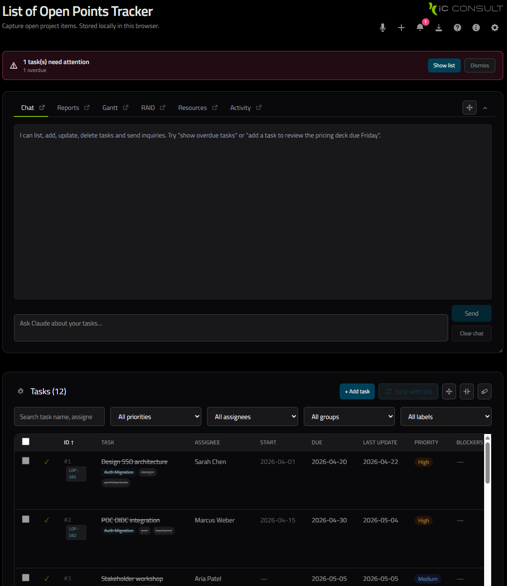
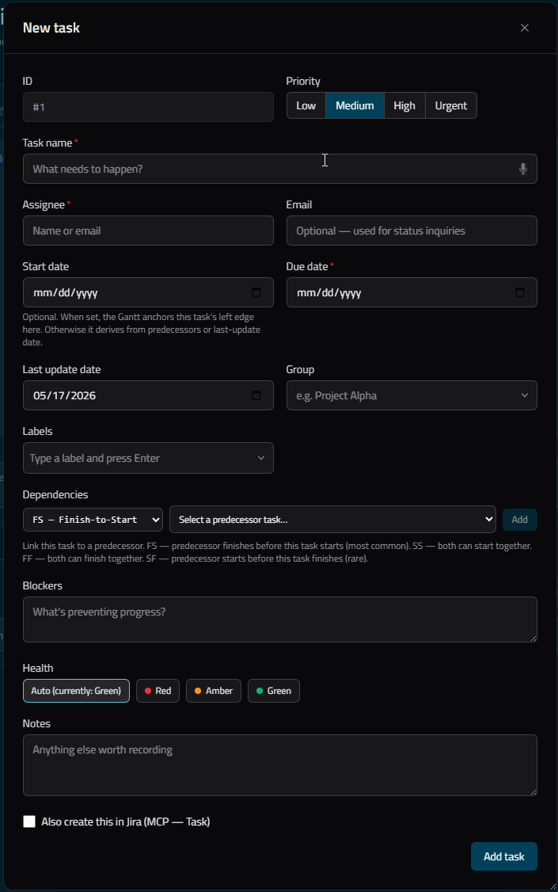
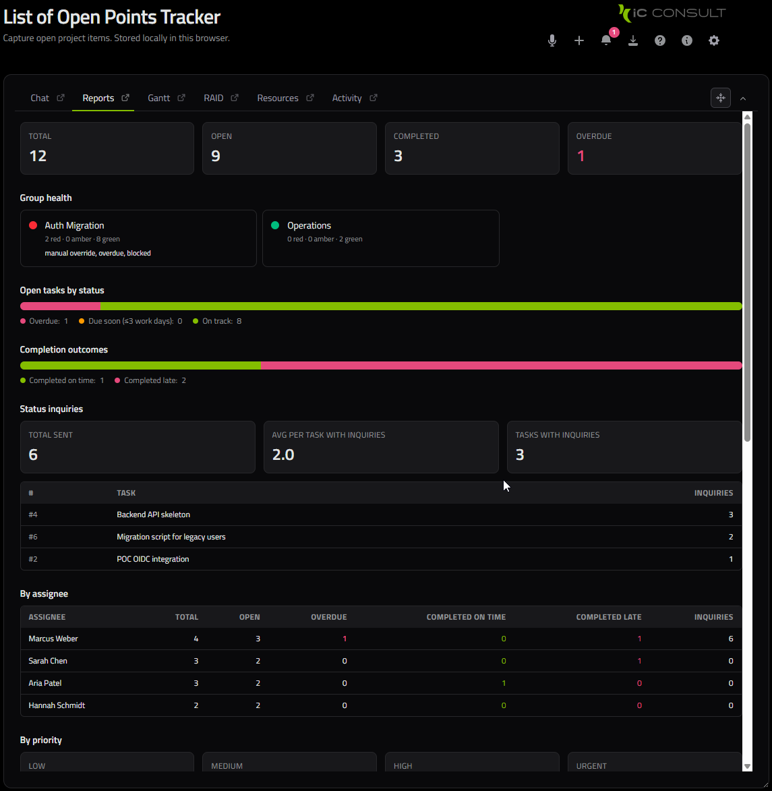
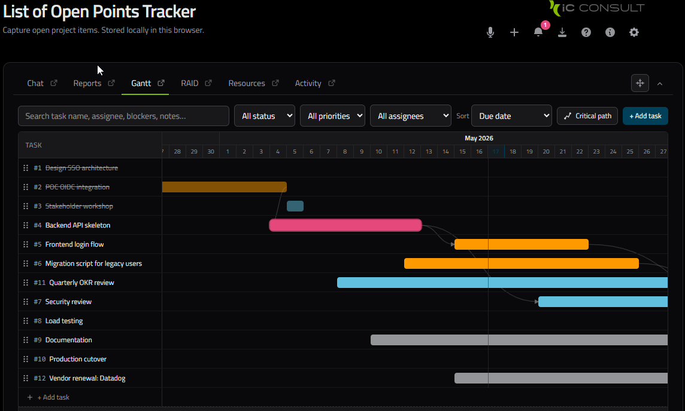
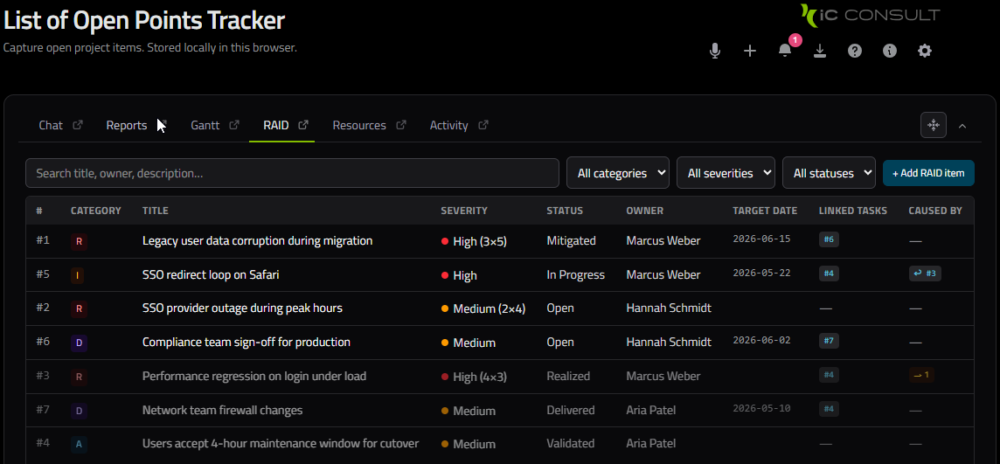
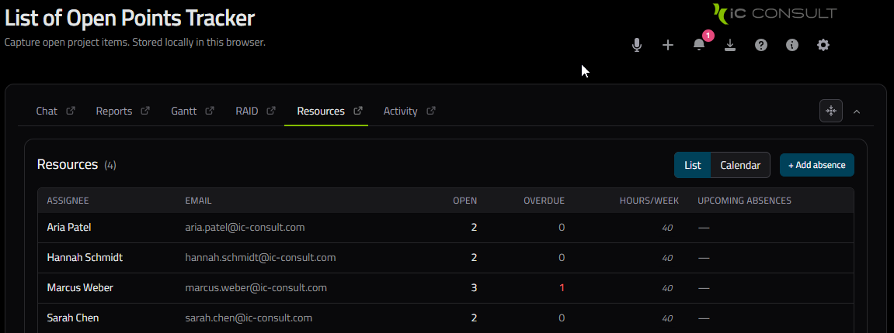
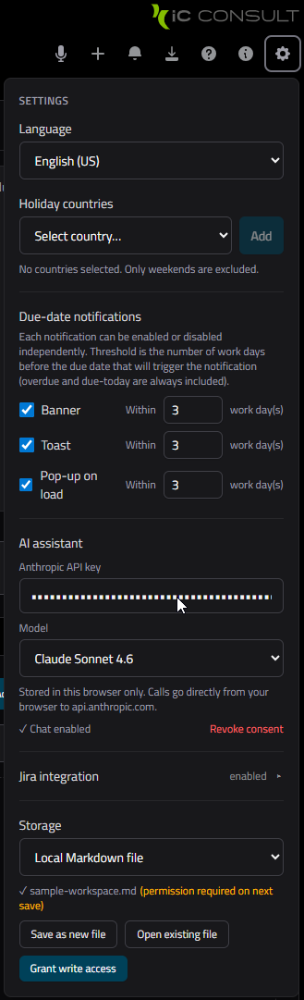

# AIPM Project Management Tracker

[](https://gitlab.example.com/example-group/public-collab/lop-app/-/commits/main)
[](https://gitlab.example.com/example-group/public-collab/lop-app/-/commits/main)

**v0.46.0 "Banks"** — AI-assisted project-status tracker for Acme project leads. Manage open points, track accountability, plan resource capacity & cost, keep an address book of the team, and draft status-inquiry emails — all in the browser, no backend required. Includes a consolidated project-health **Dashboard** (RAG status, milestones, and Earned Value SPI/CPI that feed the Schedule/Budget RAGs), **Milestones**, and **Earned Value** reporting. Integrates with Microsoft 365 (Outlook contacts/calendar, SharePoint storage) and Turso database backends.

The app ships a **modern sidebar layout** by default — a Dark-Blue left rail with grouped navigation, a top bar, full-viewport single-view content, full-page task editor and Settings pages, and a Light / Dark / System theme — with the original single-scroll **Classic mode** kept as a toggle (Settings → Appearance → Layout).

## What It Does

A single-page task manager built for project leads who maintain a "List of Open Points" (LOP). Core workflow:

1. Add tasks with assignee, due date, and priority
2. Filter, sort, and view tasks in a table or Gantt chart
3. Ask the integrated Claude AI chat to create, update, or summarize tasks in natural language
4. Send pre-filled status-inquiry emails to assignees with one click
5. Export the task list to CSV, Markdown, PDF, DOCX, XLSX, or PPTX
6. Optionally sync tasks bidirectionally with a Jira project
7. Track RAID items and create reports to the steering commitee
8. Plan capacity, utilization, availability and cost rates internally and externally while considering holidays

The **Claude AI chat** (Settings → AI; user-supplied API key) understands natural-language commands ("mark all overdue tasks as delayed", "add a task for Alice due next Friday") and answers questions about your open points. **Voice commands** (Web Speech API, EN/DE) provide the same capability hands-free.

All data is stored locally by default — no backend account required.

## Features

| Feature | Description |
|---------|-------------|
| Task management | Create, edit, delete, bulk-edit, filter by priority / assignee / group / label; optional effort fields (Original estimate & Time spent in w/d/h/m, Jira basis 1w=5d 1d=8h) with hideable/sortable Est./Spent columns and an inline effort progress bar |
| Gantt chart | Visual timeline with drag-and-drop reorder and dependency arrows; clicking a task name opens the task editor |
| Task dependencies | FS / SS / FF / SF predecessor relationships with cycle detection |
| Groups & labels | Categorize tasks freely; filter by group or label |
| AI chat (Claude) | Ask questions or create/update tasks in natural language |
| Voice commands | Speak commands in English or German (Web Speech API) |
| Reminders | Banner, toast, and popup alerts for approaching deadlines and birthdays; a unified "days ahead" lead that shifts off weekends / holidays / absences onto a working day; per-reminder snooze (1 hour / 1 day) |
| Reports | Summary view with overdue, due-soon, and completion stats |
| RAID register | Risks / Assumptions / Issues / Dependencies log with parent/child cycle detection |
| Resource planner & address book | First-class resources with an address book (name, title, contact details, company, birthday) in a Directory tab; two-dimensional roles (discipline × grade) carrying internal/external rates; absences; per-period utilization planning grid (week or month) → capacity, cost & margin with read-only rollup; pop-out resources report and address-book window |
| Budget planner | PO-line budget buckets (T&M / fixed-price) with per-role allocations, a three-value CCI (margin / cost-performance / consumption), win/loss with spillover, and multi-currency display via ECB rates; buckets are removable, drag-reorderable, and fully editable via a dedicated modal (name, PO, type, currency, fixed-price amount, dates, spillover successor, manual FX override, role picker) |
| Activity log | Browser-local chronological record of task / RAID / absence / shift CRUD with text / wildcard / regex search |
| Contacts | Assignee address book — persists across task deletion and Jira sync churn; auto-suggests on task forms |
| Jira sync | Pull from and push to a Jira Cloud project (bidirectional, with conflict resolution); optional API-token-expiry reminder, and clear messages when the token is expired/invalid or Jira is unreachable |
| Microsoft 365 sign-in | MSAL browser PKCE sign-in with lazily-loaded consent flow; master toggle in Settings → Integrations (default OFF) |
| Outlook contacts import | Import personal contacts from Outlook (Graph `/me/contacts`) into the Resource Directory and assignee address book via a preview-and-pick dialog; updates existing by email |
| Outlook calendar import | Import time-away events (all-day, Out-of-Office) from Outlook (Graph `/me/calendarView`) as Absences via a preview-and-pick dialog with per-row absence-type selector |
| Draggable modals | Every modal window (task editor, budget editor, role manager, resource editor, …) is repositionable by dragging its title bar |
| Pop-out windows | Open Chat, Gantt, RAID, Resources, Activity, or the address book in their own window — read-only mirror views synced live from the main window |
| Export | CSV, Markdown, PDF (print), DOCX, XLSX, PPTX |
| Localization | English (US / UK) and German |
| Layout & theme | Modern Dark-Blue sidebar layout (default) with grouped navigation, full-viewport single-view content, a full-page task editor (5 stacked sections) and full-page Settings; a single-page **Classic mode** toggle (Settings → Appearance → Layout); Light / Dark / System theme on the AIPM brand palette; URL-hash deep-linking (`#gantt`, `#raid`, …) |
| Printing | Scoped print — printing a report (Reports, RAID Report, Resources Report) or the Activity log prints just that view (sidebar, top bar, banners, and other panes are hidden) on A4 |

## Screenshots

<details>
<summary>Here are some screenshots...</summary>








</details>

## Storage Backends

The app persists tasks in one of several backends, switchable in Settings:

| Backend | Description |
|---------|-------------|
| Browser (default) | `IndexedDB` (schema v6) for tasks, RAID, absences, resources, roles, disciplines, grades, and the resource plan (record-level writes, legacy `localStorage` data migrates on first load); `localStorage` for settings — zero setup, survives page refresh |
| Local JSON / CSV / Markdown | File System Access API — reads and writes a local file you pick |
| SharePoint JSON / CSV | Store workspace as a single JSON or CSV blob in a SharePoint Sites document library via Microsoft Graph; requires M365 sign-in (configure in Settings → Integrations; paste the file URL in Storage Configuration) |
| Turso (libSQL) | Store workspace in a Turso (libSQL) database via the HTTP `/v2/pipeline` API — a **relational schema** with one table per entity (tasks, RAID, absences, shifts, resources, roles, disciplines, grades, budget buckets, plan, FX rates); single-blob databases from 0.25.x import automatically on first load. Configure in Settings → Integrations (Database URL + Auth token) or via `NEXT_PUBLIC_TURSO_DATABASE_URL` / `NEXT_PUBLIC_TURSO_AUTH_TOKEN` env vars. Works with **Turso Cloud** (`libsql://…` URL + token) and a **local / self-hosted `tursodb`** — run `tursodb mydb.db --sync-server 127.0.0.1:8080` and set the URL to `http://127.0.0.1:8080` with the token blank (plaintext `http://` is permitted only for loopback hosts) |

The Jira integration stores credentials (site URL, email, API token) in `localStorage`. They are never sent to any server other than your own Atlassian domain via the local proxy routes below.

## API Routes

All routes are CORS proxy endpoints — the browser calls them, they call Atlassian, and forward the response. Credentials are sent in the POST body and are never persisted server-side.

| Route | Purpose |
|-------|---------|
| `POST /api/jira/test` | Verify credentials (calls `/rest/api/3/myself`) |
| `POST /api/jira/projects` | List accessible projects |
| `POST /api/jira/issue-types` | List issue types for a project |
| `POST /api/jira/users` | Search assignable users |
| `POST /api/jira/search` | Run a JQL query (paginated) |
| `POST /api/jira/create-issue` | Create a new Jira issue from a local task |
| `POST /api/jira/update-issue` | Push local task edits back to Jira |
| `POST /api/jira/transition-issue` | Change the issue's workflow status category |

## Commands

<!-- AUTO-GENERATED from package.json scripts -->
| Command | Description |
|---------|-------------|
| `npm run dev` | Start Next.js dev server with hot reload on http://localhost:3000 |
| `npm run build` | Production build — runs TypeScript type-check, then emits `.next/` |
| `npm run start` | Serve the production build (run `npm run build` first) |
| `npm run lint` | Run ESLint (`eslint-config-next` preset) |
| `npm run test` | Vitest unit/component tests in watch mode |
| `npm run test:run` | Vitest, single run (CI-friendly) |
| `npm run test:coverage` | Vitest + v8 coverage report (fails below 80%) |
| `npm run e2e` | Playwright E2E suite, headless |
| `npm run e2e:ui` | Playwright interactive UI mode |
| `npm run e2e:install` | One-time: download Chromium browser binary |
| `npm run docs:scripts` | Regenerate AUTO-GENERATED scripts tables in repo docs from `package.json` |
| `npm run docs:scripts:check` | Verify AUTO-GENERATED scripts tables are in sync; exit non-zero on drift (CI mode) |
<!-- END AUTO-GENERATED -->

## Tech Stack

- **Framework**: Next.js 16 (App Router)
- **UI**: React 19, Tailwind CSS 4
- **Language**: TypeScript 5
- **AI**: Anthropic Claude API (key stored client-side in Settings)

## Setup

```bash
npm install
npm run dev
```

Open [http://localhost:3000](http://localhost:3000).

### Environment Variables (optional)

No environment variables are **required** — all integrations work via in-app Settings. However, you may set these optional **build-time** variables to pre-configure integrations:

| Variable | Purpose |
|----------|---------|
| `NEXT_PUBLIC_MSAL_CLIENT_ID` | Microsoft Entra app client ID (overrides Settings → Integrations input) |
| `NEXT_PUBLIC_MSAL_TENANT_ID` | Microsoft Entra tenant ID (overrides Settings → Integrations input) |
| `NEXT_PUBLIC_TURSO_DATABASE_URL` | Turso database URL (overrides Settings → Integrations input) |
| `NEXT_PUBLIC_TURSO_AUTH_TOKEN` | Turso auth token (overrides Settings → Integrations input); **recommend a scoped token** |

The Claude API key and Jira credentials are entered in the in-app Settings panel and stored in `localStorage`.

### Microsoft 365 Integration

To enable Microsoft 365 features (Outlook contacts/calendar import, SharePoint storage):

1. Register an app in [Microsoft Entra admin center](https://entra.microsoft.com/).
2. Create a single-page application (SPA) with redirect URI `http://localhost:3000` (dev) or your production URL.
3. Grant API permissions: `Contacts.Read`, `Calendars.Read`, `Sites.ReadWrite.All` (or scoped equivalently).
4. Copy the **Client ID** and **Tenant ID** into Settings → Integrations, or set env vars above.
5. The app uses MSAL in the browser for PKCE sign-in (no backend token exchange needed).

**Security note**: Turso auth tokens live in the browser (localStorage or as `NEXT_PUBLIC_*` env vars, which are **not secret**). Use a Turso token scoped to the minimum required database and operations; rotate if exposed.
