# AI PM Cockpit

[](./CHANGELOG.md)
[](./LICENSE)

> **The AI project-management cockpit that knows *your* project.**
>
> A command surface for project leads with a Claude copilot grounded in your operating guides and the view you're in. It surfaces the next best action and can act on it. It plugs into the Microsoft 365 / Jira / Timelog stack you already use, so it accelerates your workflow instead of becoming one more place to re-key data. Local-first, bring-your-own-key and open source, with no backend account required.

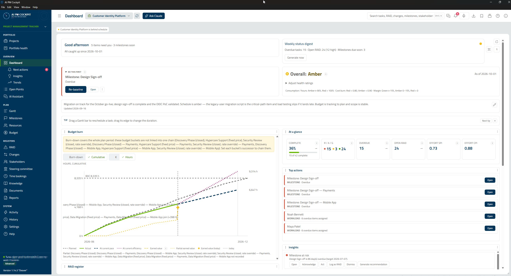

<sub>The landing dashboard.</sub>

https://github.com/user-attachments/assets/84b8ec64-25ec-4a76-91cf-9855cc346245

<sub>Guided product tour (no audio): dashboard, next actions, open points, Gantt, milestones, the Claude assistant, resources, budget, RAID, changes and stakeholders. If your viewer does not play it inline, [download the clip](public/demos/demo-aipm-cockpit.webm).</sub>

---

## Why AI PM Cockpit

**A copilot that knows *this* project.**
The Claude assistant is grounded in your operating guides, so its advice fits this project rather than reading like a generic chatbot. Per-view "Ask Claude" prompts and one-tap starters (a risk review, a weekly status update, a stakeholder update, "prioritize all tasks") mean the tool tells you the next step and can take it, creating and updating tasks, RAID, changes, milestones, and stakeholders in natural language.

**It tells you what it cannot see.**
The assistant knows which view you are on. On Open Points, Workload, Gantt and Budget it also knows what your current filters are showing. Where no tool can answer it says so, by name: time bookings, the activity log, cross-project portfolio data, RACI assignments, calendar absences.

**Plugs into the stack you already use.**
Pull people in from Outlook, attach documents straight from SharePoint, push milestones to your calendar, sync a two-way Jira project (plus optional read-only monitor projects), and fold actual Timelog bookings into your budget, without re-keying the same data.

**Own your data.**
It runs in your browser with no backend account. Bring your own API keys; they're encrypted at rest (AES-256-GCM, device-sealed).

**One cockpit for the whole engagement.**
Project-health RAG, RAID and change-control registers, a stakeholder register with RACI, resource capacity and budget with Earned Value (in EUR, USD, GBP or INR), and a multi-project portfolio, all in one surface, with a landing dashboard that opens on what needs you.

**A solo consultant and a regulated multi-workstream programme run the same tool.**
No two project leads track the same things, so the cockpit bends to fit: see work as a table, Kanban board or Gantt, toggle whole feature modules off, pick a Simple / Modular / Advanced mode that gates complexity, and start from a reusable project template that presets it all.

### Built to be trusted

The cockpit is in active friendly-user testing, used by project leads on real projects. It is backed by a unit and component suite under coverage floors that are enforced rather than merely reported (lines, statements, functions and branches, plus tighter per-engine floors), a WCAG accessibility gate (axe across 17 views × 7 theme/scheme combinations), semgrep SAST, and duplication and file-size ratchets, all blocking in CI. Local-first and bring-your-own-key by design: no server stores your data or credentials (the handful of API routes are stateless proxies to services you configure), so the browser profile is the security boundary (see [Security Model](docs/security.md#security-model)).

### See it in a minute

1. Install the desktop app from the [Releases page](https://github.com/sebastianmaute/aipm-cockpit/releases), open it, and click **Explore a demo project** to load a realistic workspace.
2. Add or import tasks; view them as a table, a Kanban board, or a Gantt chart.
3. Open the Dashboard for health, ranked top actions, and trends, then ask the copilot "What's next?".
4. Wire up Jira / Microsoft 365 / Timelog in Settings when you want it plugged into your stack.

### Screenshots

All taken in the desktop app on the demo project. Click any image for the full size.

<table>
<tr>
<td width="50%"><a href="docs/assets/open-points.png">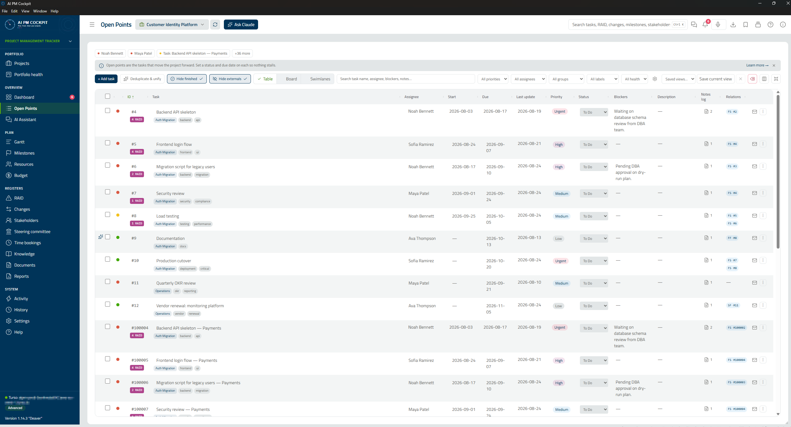</a><br><sub><b>Open Points.</b> The task table, with RAID links, blockers and dependencies on each row.</sub></td>
<td width="50%"><a href="docs/assets/swimlanes.png">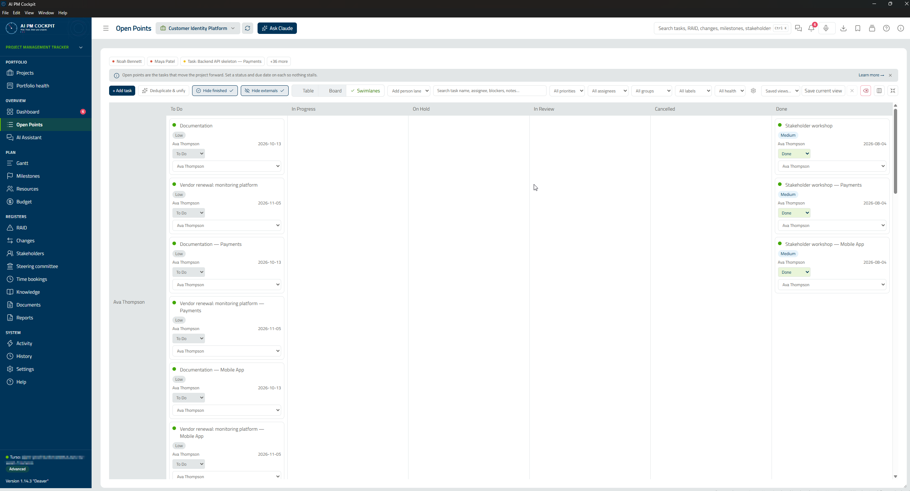</a><br><sub><b>Swimlanes.</b> The same tasks as a board, one lane per person.</sub></td>
</tr>
<tr>
<td><a href="docs/assets/gantt.png">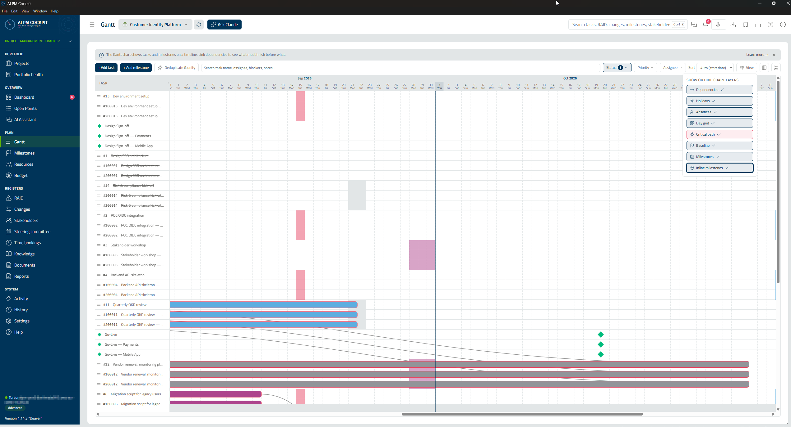</a><br><sub><b>Gantt.</b> Tasks and milestones on a timeline; the View menu switches dependencies, holidays, absences, critical path and baseline on and off.</sub></td>
<td><a href="docs/assets/raid.png">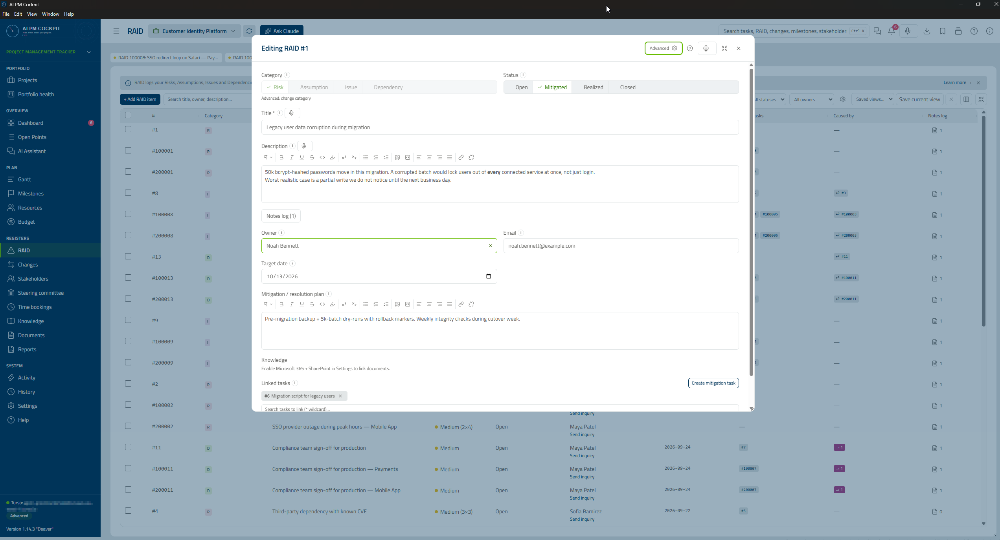</a><br><sub><b>RAID.</b> A risk with its mitigation plan, owner and linked task.</sub></td>
</tr>
<tr>
<td><a href="docs/assets/budget.png">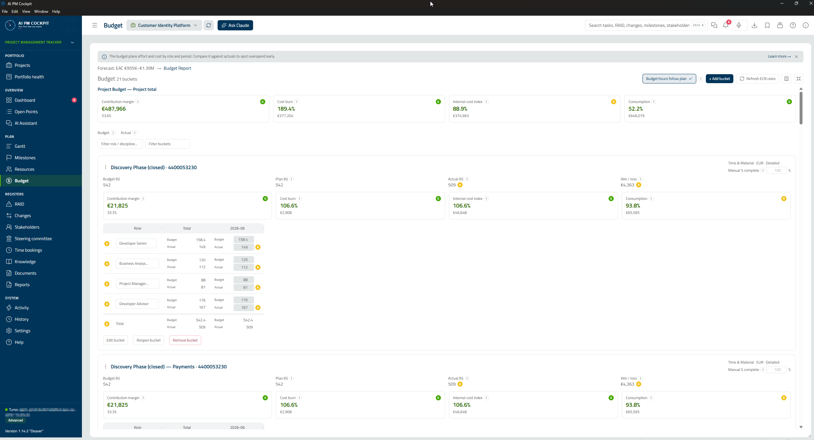</a><br><sub><b>Budget.</b> Budget buckets planned by role and month, with margin, cost burn and consumption.</sub></td>
<td><a href="docs/assets/budget-report-efficiency.png">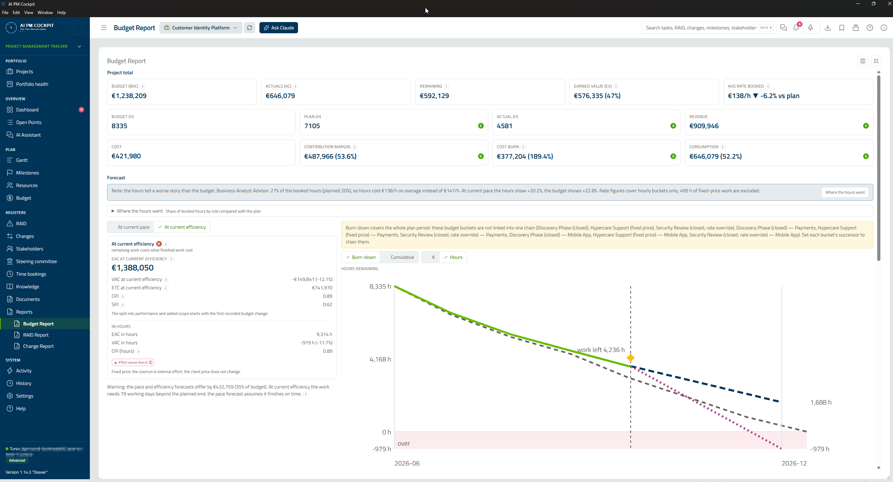</a><br><sub><b>Budget report.</b> Earned value and a forecast at current efficiency, beside the burn-down.</sub></td>
</tr>
<tr>
<td><a href="docs/assets/budget-report-pace.png">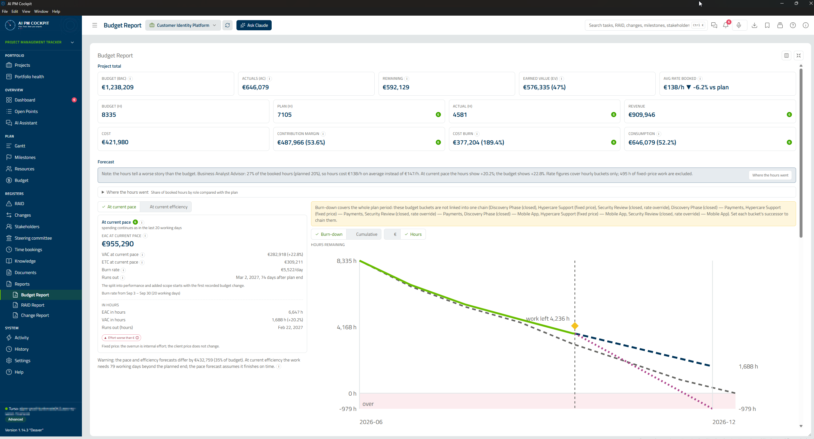</a><br><sub><b>Forecast at current pace.</b> The same report projected from the last 20 working days' spend, with the run-out date.</sub></td>
<td><a href="docs/assets/changes.png">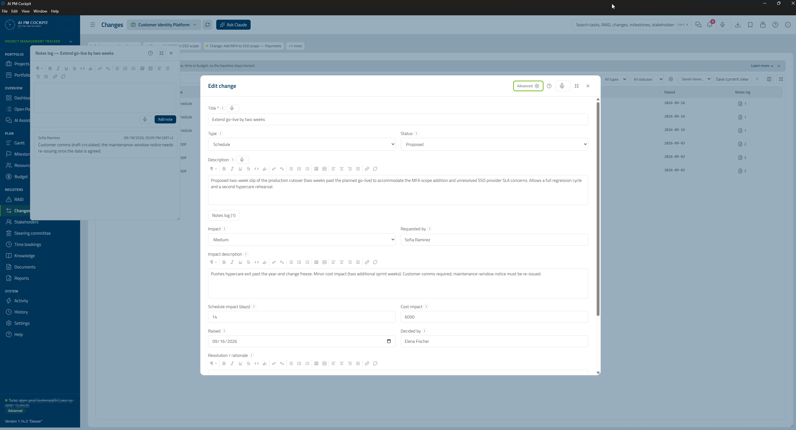</a><br><sub><b>Changes.</b> A change request with schedule and cost impact, and its notes log.</sub></td>
</tr>
<tr>
<td><a href="docs/assets/stakeholders.png">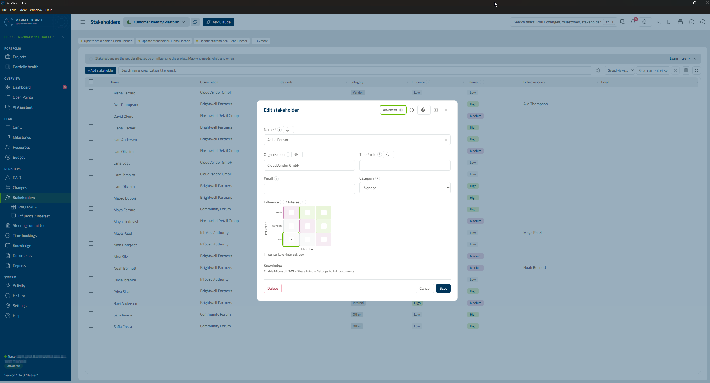</a><br><sub><b>Stakeholders.</b> The register, with influence and interest set on a grid.</sub></td>
<td><a href="docs/assets/raci.png">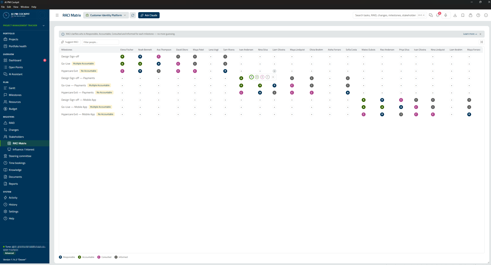</a><br><sub><b>RACI matrix.</b> Who is responsible, accountable, consulted and informed per milestone; gaps and clashes are flagged.</sub></td>
</tr>
<tr>
<td><a href="docs/assets/knowledge.png">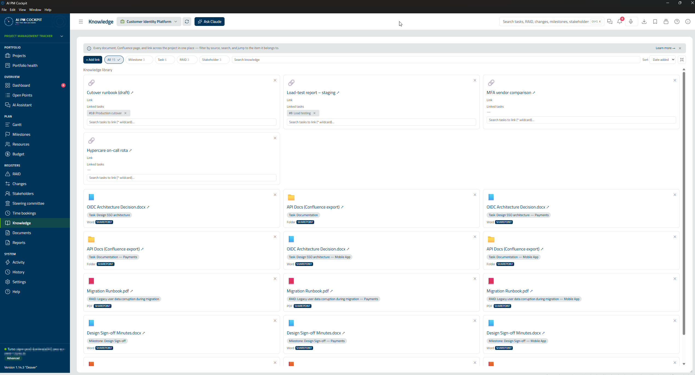</a><br><sub><b>Knowledge.</b> Every link and SharePoint document in the project, each tied to the item it belongs to.</sub></td>
<td><a href="docs/assets/version-history.png">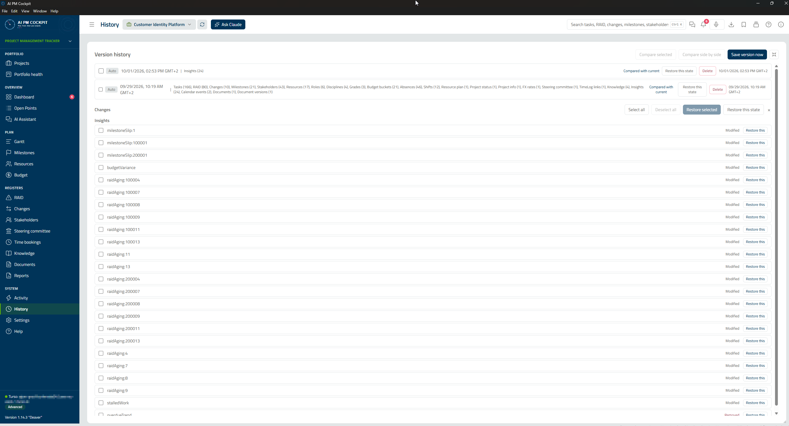</a><br><sub><b>Version history.</b> Compare saved versions and restore a whole state or single items (Turso projects).</sub></td>
</tr>
<tr>
<td><a href="docs/assets/operating-guides.png">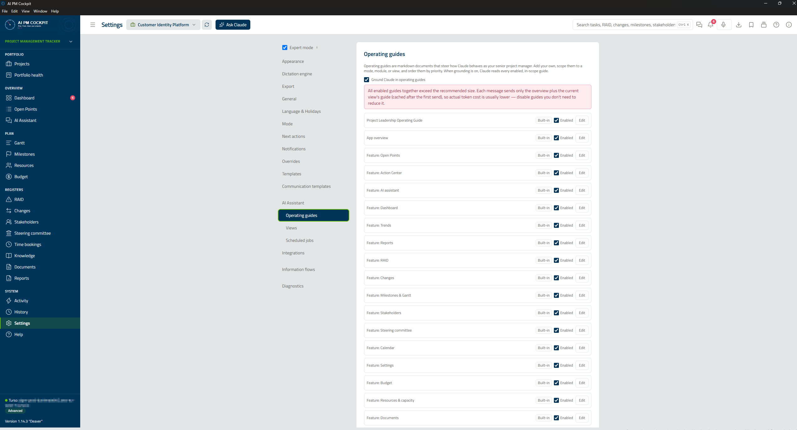</a><br><sub><b>Operating guides.</b> The documents that ground Claude's advice; switch them on or off, edit them, or add your own.</sub></td>
<td><a href="docs/assets/information-flows.png">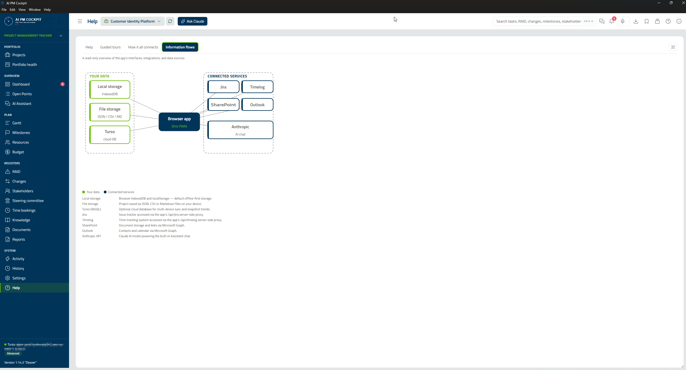</a><br><sub><b>Information flows.</b> Where your data lives and which services the app talks to.</sub></td>
</tr>
<tr>
<td><a href="docs/assets/new-project.png">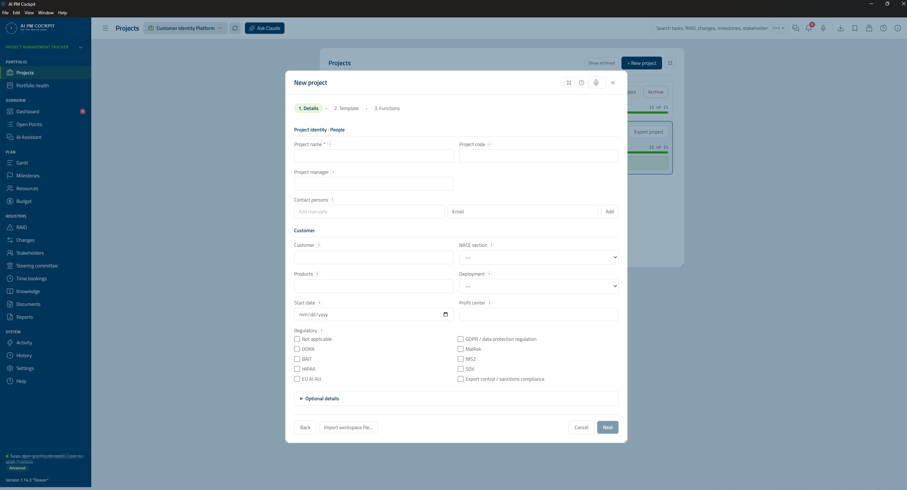</a><br><sub><b>New project.</b> A three-step wizard: details, template, then which functions to switch on.</sub></td>
<td><a href="docs/assets/help.png">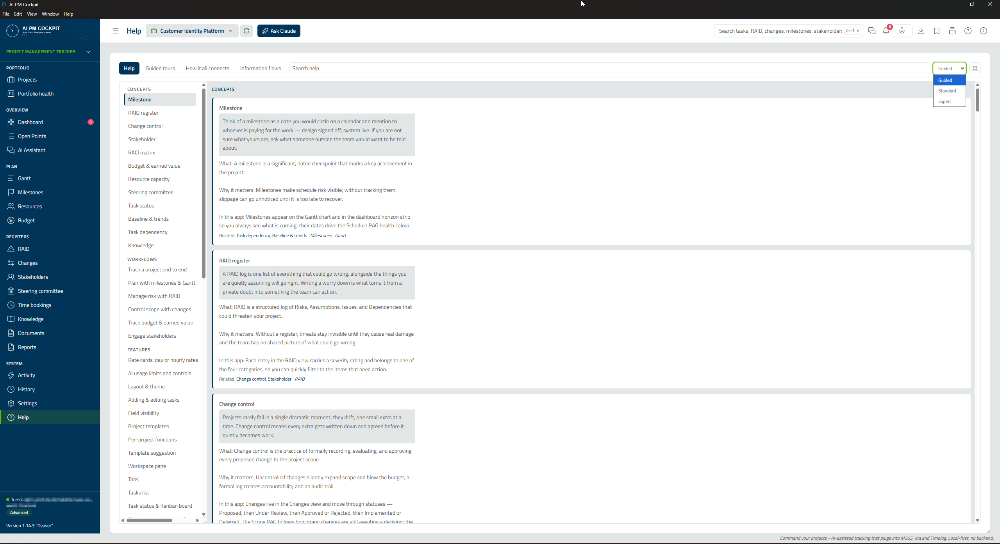</a><br><sub><b>Help.</b> Built-in explanations of every concept and workflow, at a Guided, Standard or Expert level.</sub></td>
</tr>
</table>

---

## Get started

### Install the desktop app

Most people should use the desktop build: it installs per-user, needs no
admin rights, and requires neither Node.js nor a terminal. Download the
installer from the [Releases page](https://github.com/sebastianmaute/aipm-cockpit/releases).

Two things surprise people on a first run, and both are expected:

- Windows shows a **"Windows protected your PC"** box, because the app is not
  code-signed. Choose **More info → Run anyway**.
- The app **starts empty even if you have used it in your browser**. The
  desktop build keeps its own data store; nothing has been lost, and the
  browser version still has its own copy.

[docs/desktop-rollout.md](docs/desktop-rollout.md) has the full first-run
walkthrough, including which settings you need to re-enter and where the log
file lives if it does not start.

### Run from source

For development, or to run it without installing anything:

```bash
npm install        # install dependencies
npm run dev        # start the development server
```

Open [http://localhost:3000](http://localhost:3000).

No environment variables are required: every integration is configured in-app
via Settings. See [docs/security.md](docs/security.md#environment-variables)
for the optional build-time overrides.

For a production build, and for prerequisites and the full script table, see
[CONTRIBUTING.md](CONTRIBUTING.md).

### Development scripts

The handful you need to work on the app:

| Command | Description |
|---------|-------------|
| `npm install` | Install dependencies (run once, and after a dependency change) |
| `npm run dev` | Start the dev server with hot reload |
| `npm run build` | Production build — type-check, then emit `.next/` |
| `npm run start` | Serve the production build (run `npm run build` first) |
| `npm run test:run` | Unit and component tests, single run |
| `npm run lint` | ESLint |

That is a curated subset. The full script table is generated from
`package.json` and lives in [CONTRIBUTING.md](CONTRIBUTING.md#scripts): every
gate, checker and test runner in the repo, each with the caveat that bites when
you run it. It is the one authoritative copy; this list is a starting point, not
a second inventory to keep in sync.

## Tech stack

- **Framework**: Next.js 16 (App Router, Turbopack)
- **UI**: React 19, Tailwind CSS 4
- **Language**: TypeScript 6
- **Testing**: Vitest 5 (unit/component, v8 coverage), Playwright (E2E)
- **AI**: Anthropic Claude API (key entered client-side in Settings; encrypted at rest)
- **Optional storage**: Turso (libSQL), Microsoft Graph / SharePoint

## Documentation

This README is the entry point. Each document below owns its subject outright
rather than restating this one.

| Document | What it owns |
|----------|--------------|
| [docs/features.md](docs/features.md) | The complete feature list — every capability the app ships, one row each, with the full description behind an expandable **Details** block. |
| [docs/storage.md](docs/storage.md) | Storage backends: file, Turso and IndexedDB; browser support; multi-tab editing; emergency recovery. |
| [docs/integrations.md](docs/integrations.md) | Jira, Microsoft 365 and Timelog — configuration, sign-in, and where credentials are kept. |
| [docs/automation.md](docs/automation.md) | The scheduled reminders the app raises on its own. |
| [docs/ai-cost.md](docs/ai-cost.md) | Prompt caching: the layout, what it bought and cost, and the prompt-quality harness. |
| [docs/security.md](docs/security.md) | What is stored where, what leaves the browser, and the build-time environment variables. |
| [docs/desktop-rollout.md](docs/desktop-rollout.md) | Installing the desktop app: what to expect on a first run and what to send when reporting a problem. |
| [CONTRIBUTING.md](CONTRIBUTING.md) | Setup, the full script table, project layout, conventions, the testing layers, and the pull-request checklist. |
| [docs/RUNBOOK.md](docs/RUNBOOK.md) | Operations: build and deploy, hosting, security headers, rollback, secrets, monitoring, and a symptom-indexed list of common issues. |
| [docs/CODEMAPS/](docs/CODEMAPS/) | Five layered overviews of the codebase — architecture, frontend, backend, data, dependencies. |
| [AGENTS.md](AGENTS.md) | The always-loaded engineering reference: hard CI-enforced constraints and the landmines that have already cost someone a debugging session. |

## Support

If AI PM Cockpit saves you time, you can support its development through
[GitHub Sponsors](https://github.com/sponsors/sebastianmaute).

## License

European Union Public Licence v1.2 (EUPL-1.2). See the [LICENSE](./LICENSE) file for the
full text, also available at the [European Commission](https://interoperable-europe.ec.europa.eu/collection/eupl/eupl-text-eupl-12).
